# Les basiques d'un ordinateur
> Source : https://www.youtube.com/playlist?list=PLH2l6uzC4UEW0s7-KewFLBC1D0l6XRfye

## Random Lexique
1 bits = 0 ou 1
1 byte = 8 bits
hexadecimal = binary sur une base 15 (1 à F)
Binary, les 0 à gauche valent 0

## Basique
Le binaire qui veut dire 2 états, soit 0 ou 1, qui correspond au flow d'electricité (le courant passe ou pas). Cela peut aussi être "On" state quand le courant circule (Vrai) et "Off" State quand le courant ne passe plus (false).

Les transistors permettent de faire un peu plus que 2 états, il y avait certains ordinateurs qui était en ternary (3 states) ou Quinary (5 states). Le probleme est que plus il y a d'état, plus c'est dur de les garder séparé, ce qui est prône à l'erreur et à plusieurs millions d'opérations à la seconde, c'est préférable de limiter les erreurs.

De plus, une branche de math existe déjà basé sur le concept de True/False, c'est l'algebre booleene.

## Algebre Booelene en electronique
Il y a plusieurs opérations possibles :
- AND (L'un et l'autre)
- OR (L'un ou l'autre)
- Not (Inverse la valeur booleene, il prend qu'unn seul bool)

C'est un comportement facile à reproduire avec des transistors.

### And Gate
Cela se crée avec 2 transistors collés à l'autre pour avoir 2 inputs et 1 output.
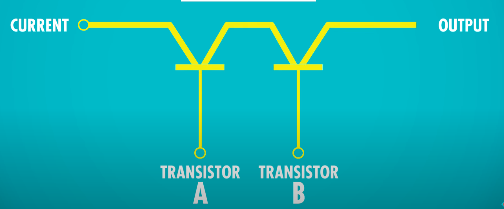

### OR Gate
Cela nécessite un peu plus de cable que la AND Gate, car il faut mettre les transistors à l'opposé pour que le courant puisse passer d'un coté ou de l'autre. L'arc signifie que les cables se chevauchent mais ne sont pas connectés

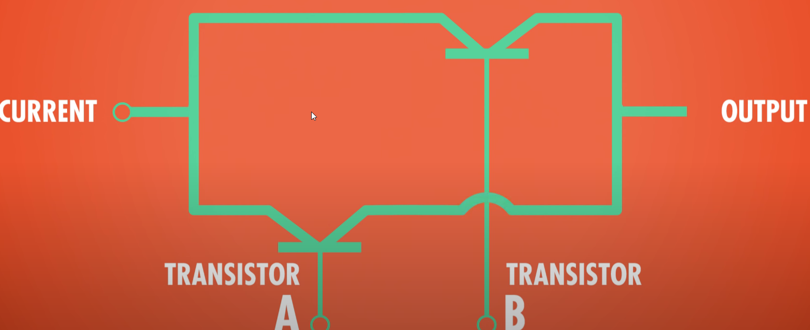

### Not Gate
C'est un peu plus compliqué, mais il n'y a besoin que d'un transistor. Il faut déplacer l'output avant le transistor, de cette façon :

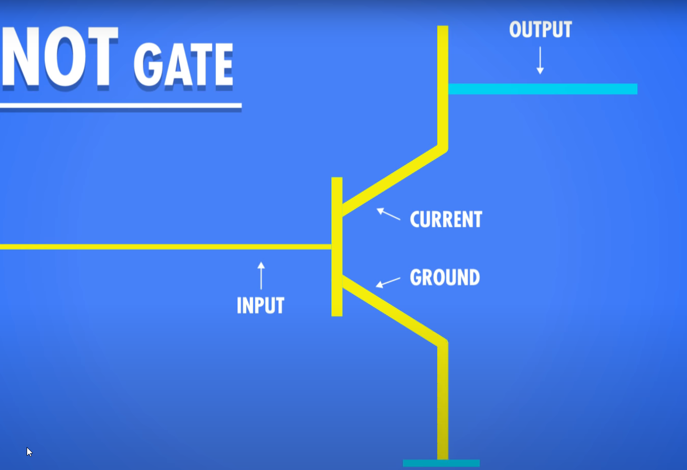

Si l'input est On, le courant passe le transistor et part dans la terre, donc l'output ne recupere pas le courant. A l'inverse, si l'input est off, le courant ne peut pas aller en terre et donc passe par l'output.

### XOR
Enfin, la derniere opération qui n'a pas été mentionné, c'est le XOR car c'est une combinaison de 3 autres.

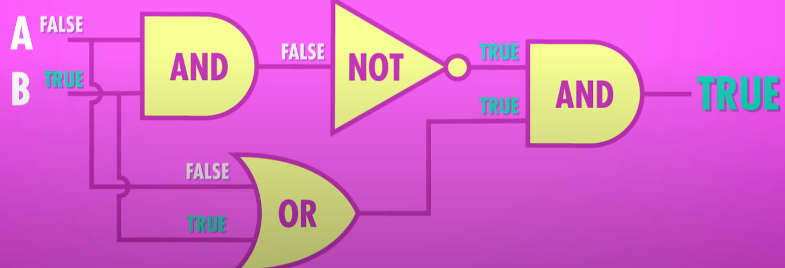

## Traduire True/False en valeur (Nombres & lettres)
Cela fonctionne comme pour les nombres et les chiffres. C'est à dire qu'on a des chiffres de 0 à 9 et on ajoute plus de chiffre pour constituer des nombres. C'est juste en base deux au lieu d'être en base 10.

Ce qui donne au lieu d'avoir :
| 1000 | 100 | 10 | 1 |
|------|-----|----|---|

On obtient :
| 8 | 4 | 2 | 1 |
|---|---|---|---|

Cela veut dire que si on a 1011, on a 1(8), 0(4), 1(2) et 1(1), cela nous donne 11. Les additions marchent de la même façon avec les retenu
 10110111 (183)
+00010011 (19)
 11001010 (202)

 Chacun de ces 0/1 sont des bits. C'est à dire que la somme au dessus est en 8-bits soit 256 valeurs de 0 à 255. 8-bits cela s'appelle un byte, donc 1kb = 1000 kilobytes (soit 8000bits).

 Les ordinateurs doivennt aussi représenter des nombres à décimal (float). Pour cela, ils ont le standard IEEE 754. En gros, cela utilise un systeme scientifique avec un significant qui possède les chiffres (décimales et entier) avec un exposant qui permet de placer la virgule.

 Cela permet d'avoir ce genre de variable pour un float en 32-bits :
 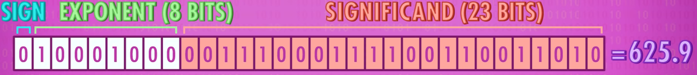

 Pour les lettres, on utilise le même systeme où elles sont numérotées et on utilise 5bits pour avoir l'ensemble des possibilités. Actuellement, on utilise le format ASCII qui utilise un 7-bits code pour avoir des symboles, ponctuation et majuscules/minuscules, avec même des LineBreak pour pouvoir passer a la ligne.

 En tant que standard, c'est devenu un moyen universel d'échanger des données, cela s'appelle de l'interoperability (interop en code). ASCII est passé à 8bits pour permettre d'inclure des caracteres nationaux comme les accents en français ou les elements cyrillic en russe. Cela avait certaines limitations notamment quand on passait d'un pays à un autre.

 Pour cela, les pays ont crée des encodages multi-bytes qui était incompatible les unsn avec les autres. C'est pour cela que l'Unicode est né. Crée en 1992, UniCode utilise 16-bits pour véhiculer plus d'un millions de code pour chaque character de tous les pays, des symboles mathematiques et même de la place pour des emoji.

 De la même manière que les lettres, les formats comme MP3s, ou GIF utilisent des chiffres binaires pour encoder des sons, des couleurs de pixels de photo.

 Tout a le même format, une longue sequence de bits qui sont traités de façon différentes.

# Le fonctionnement d'un ordinateur

Les ordinateurs actuels peuvent être en 32bits ou 64bits. Cela signifie qu'ils opérent par chunk de 32 ou 64bits. 32bits correspond à un peu moins de 4.3 milliards de possibilités. Le premier bit est souvent utilisé pour le signe (négatif ou positif), cela veut dire qu'on a plus ou moins une gamme de + ou - 2 milliards.

Cela peut paraître beaucoup mais les chiffres dans notre société prennent une démesure (7 milliards d'habitants par exemple). C'est pour cela qu'on passe à 64bits qui peuvent aller jusqu'à 9.2 quintillon.

La nécessite venait surtout du fait qu'un ordinateur moderne a des trillions de bytes et qu'il fallait pouvoir stocker les adresses pour les identifier.

## Comment le CPU execute un programe (Fetch-Decode-Execute Cycle)
En partant d'une ligne :
INC A (assembly) signifie incrémenter le registre A (c'est à dire ajouter 1 à A, peu importe ce qui est dedans). Cela prend la forme de :
00111100 en machine code (binaire).
Le binaire est souvent traduit en hexadecimal pour que ça soit plus simple à retenir, cela correspond donc à 3C

INC A = 00111100 = 3C

L'hexadecimal va de 0 à 15 (1-9 + A-F), ce qui signifie qu'il peut représenter une plage de 4bits (3 = 0011 & C = 1100), donc 3C = 1 byte

Voici, un schéma simplifié du systeme d'un microprocesseur :
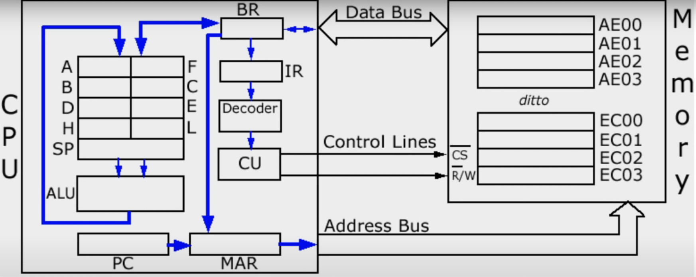

Le code sera placé dans la premiere ligne (à droite) AE00, cette adresse sera mis dans le PC (Program Counter), en partant du principe que le registre A contient 00 (H signifie qu'on est en hexadecimal), on obtient ce statut ;

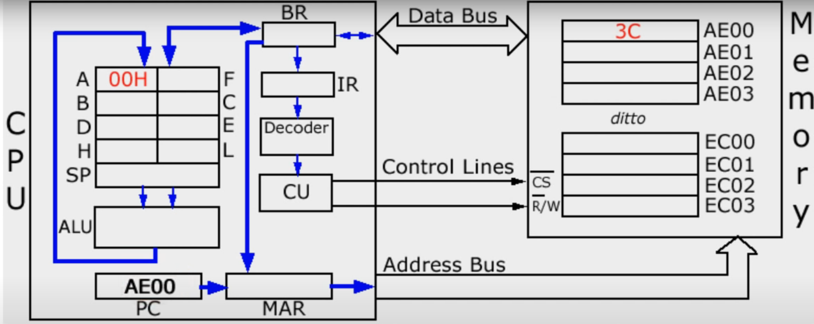

Le binary patern dans le Program Counter (AE00) est transferé dans le MAR (Memory Adress Register), ce qui fait que le PC (Program Counter) augemnte de 1, on passe donc à l'instrction AE01.

Le contenu du MAR (Memory Adress Register) est tranferé dans l'adress bus, et le CU (Control Unit) envoie 2 low pulses dans les 2 control lines (CS line & Read/Write line => R/W Line).

Un low pulse dans la CS Line est responsable d'activer la puce, et celui dans la R/W Line assure que la location selectionnée est lue.

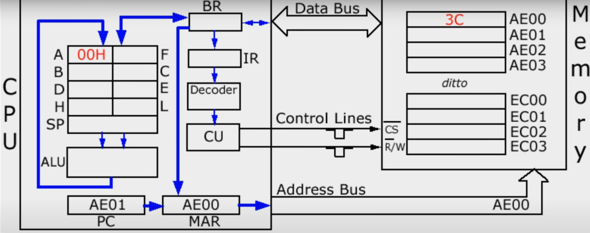

Le "3C" parlt donc dans le BR (Buffer Register) via le Data Bus et une copie est envoyé dans le IR (Instruction Register).

A ce moment la, on est à la fin du "fetch" dans le fetch-decode execute cycle.

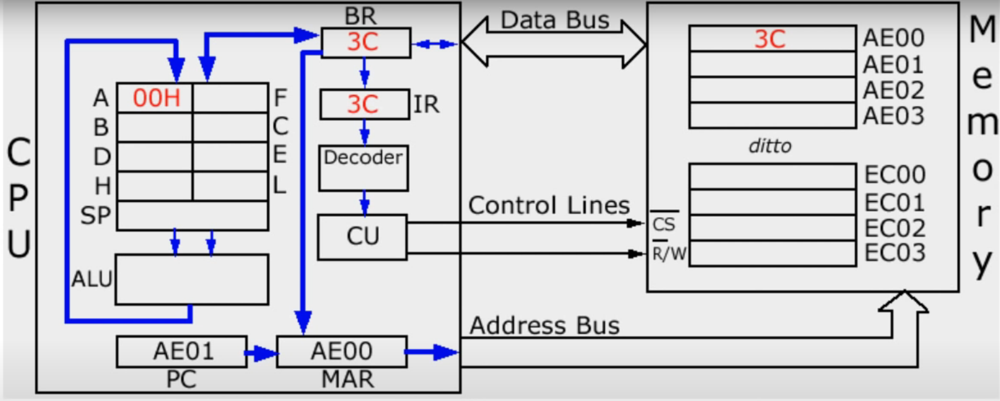

On commence donc le décodage de l'instruction. Le decoder détermine donc ce que 3C signifie et envoie l'information au CU (Control Unit). La valeur du registre A est envoyé dans l'ALU (Arithmetic and Logic Unit) et demande à l'ALU d'y ajouter 1

La nouvelle valeur est envoyé dans le registre A via l'internal Data Bus, ce qui conclut l'execute dans le fetch-decode-execute cycle.

## Comment un ordinateur Calcule? (ALU)

### Arithmetic Unit
Un ordinateur calcule grâce à l'ALU (Arithmetic and Logic Unit), c'est le cerveau mathématique de l'ordinateur. Elle a 2 units : celle arithmetic et celle logic.

L'arithmetic permet de faire des additions, soustractions, incrementer, decrementer. Pour simplifier le système, on utilise de l'abstraction et créer les composants basés sur de la logique (AND, OR, NOT, XOR). (XOR est un OU exclusif, c'est à dire l'un ou l'autre)

Voici les 4 d'opérations possibles :

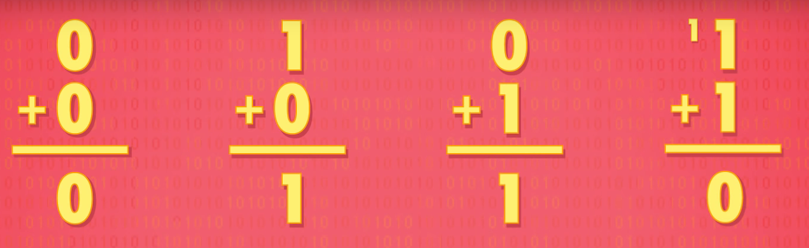
Dans le cas, du 1+1, c'est égal à 0 et le 1 est avancé sur la colonne suivannte. Ces opérations collent parfaitement avec  un tableau de logic, en partant du principe que 0 = false et 1 = true

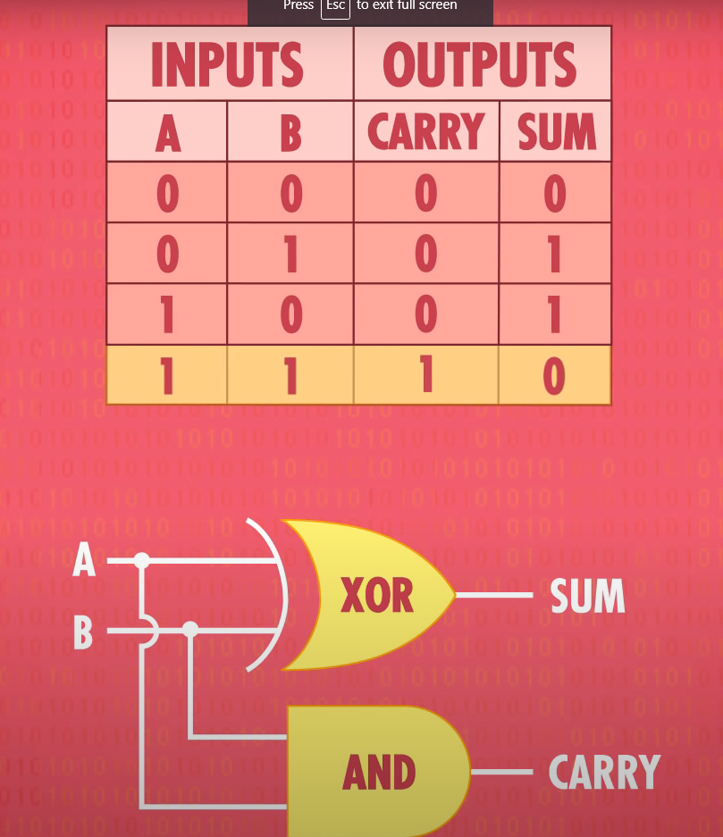

Le circuit ci-dessus est appelé un Half Adder. Il permet d'avoir 2 output : Sum et Carry basé si A & B sont vrai. Si les 2 sont vrai, la somme est fausse avec le XOR mais le carry est vrai avec le AND

Cela nous donne cette encapsulation :

Le probleme c'est que cette logique ne marche qu'avec 2 bits, en prenant en compte le carry, il faut pouvoir prendre en compte 3 bits : A, B, C

Ce qui amene à la Full Adder table :

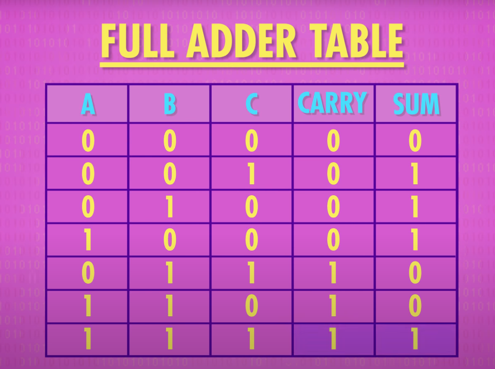

et la logique du fulladder, qui est 2 half adder : une avec les 2 valeurs initiales A & B et une avec le carry qui permet de déterminer la sum final et le carry final

Si on veut augmenter le nombre de bit supportés, il suffit juste d'aggrandir la séquence où la premiere opération ne nécessite que d'un half adder car il n'y a pas encore de carry, puis elle est suivi de full adder.

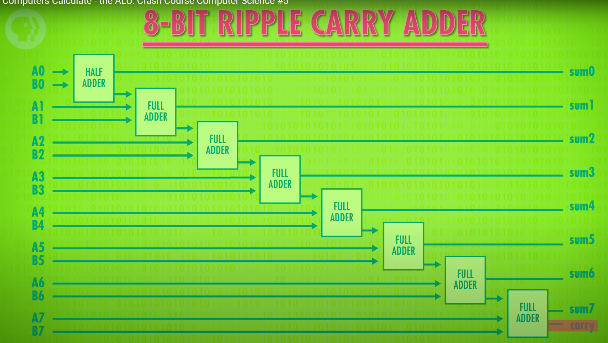

Le problème du full adder est qu'il peut finir avec un carry s'il dépasse 8bits, ce qui provoque un overflow. C'est pour cela que les éléments de 8 bits ne peuvent pas dépasser 255.

Pour éviter l'overflow, on peut aggrandir le cycle avec plus de full adder pour arriver à 16/32/64 bits mais cela prend plus de gate et cela prend plus de temps pour le carry d'être passé de cycle en cycle.

C'est pour cela que les LUA actuels utilisent un "Carry-look-ahead adder", c'est plus rapide et a la même fonctionnalité. Ce qui donne ces fonctionnalités :

Il n'y a pas de multiplication, ni de division. Aucun circuit n'est prévu pour ces opérations, l'opération fait plusieurs fois le même circuit (addition) pour faire une multiplication.

Maintenant, les téléphones portables/ordinateurs portables ont des circuits dédiés pour les multiplications. Cela nécessite plus de logic gates, c'est donc reservés aux machines puissantes et pas les éléments simples comme des micro-ondes ou des thermometres.

### Logic Unit

Elle permet de faire plusieurs tests et utilisent le même type de circuit que l'arithmetic unit. Par exemple, pour tester si un chiffre est inférieur à 0 ou si le chiffre est égal à 0. Pour tester, si un chiffre est égal à 0, on a ce type de circuit :

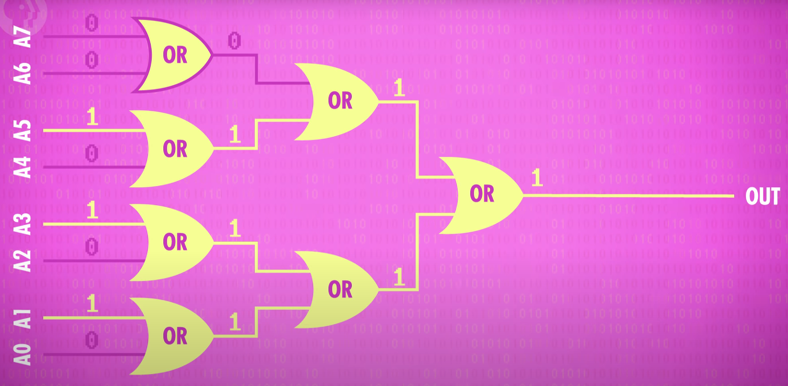

et un Not est utilisé entre le dernier OR et l'output avant d'inverser l'output pour savoir si le chiffre est bien égal à 0 (car 0 = false)

### ALU schema

Premier ALu par Intel :
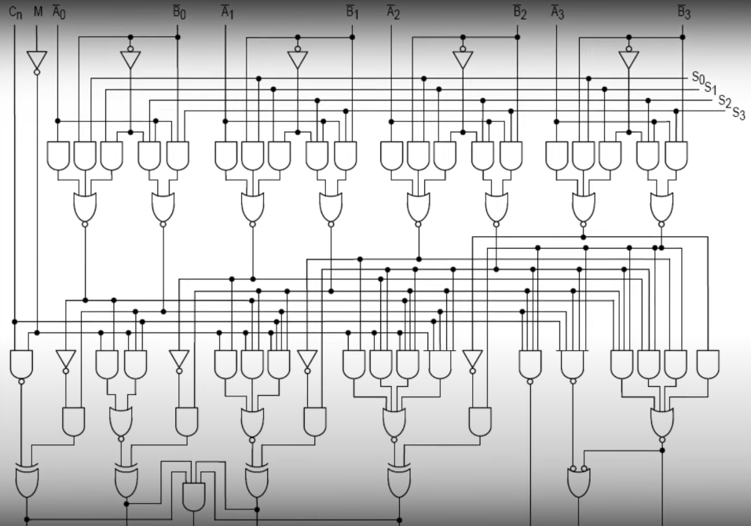

Les Alu suivent un schéma "V", voici un schéma pour un ALU à 8 bits :

Il y a donc 3 entrées : Input A, Input B qui vont être manipulés, l'opération code qui va être comment les variables vont être manipulés (00111100 ou 3C pour INC A dans l'exemple du fonctionnement du CPU)  et 2 sorties : le résultat qui est celui de l'opération et les flags qui ajoutent des informations sur l'output

## Register & RAM
Random Access Memory (RAM) stock les éléments tant qu'il y a du courant contrairement à la mémoire persistante. (A creuser sur le côté volatile, non volatile qui permet de stocker la mémoire)

### RAM
Les circuits vont naturellement dans un sens mais il est aussi possible de le faire aller dans les 2 sens

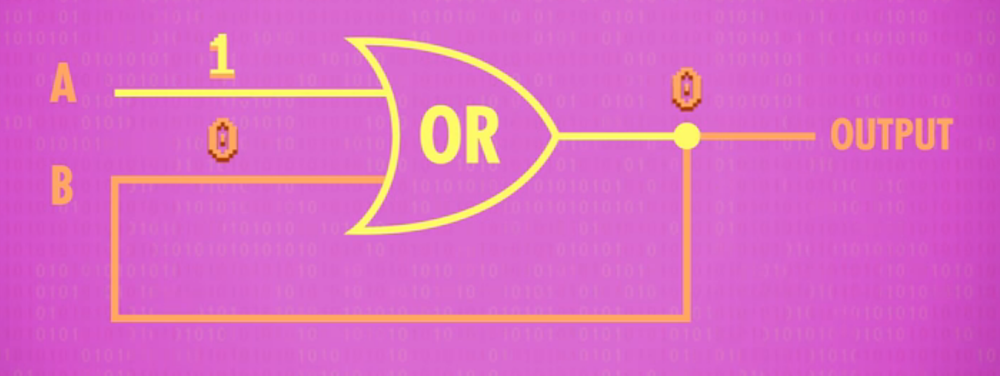

Le probleme c'est qu'on peut pas le reset (avec OR ou AND) puisque même en changeant A, on ne peut plus revenir à la situation initiale

Pour cela, il faut les combiner dans un circuit appelé : And-or Latch

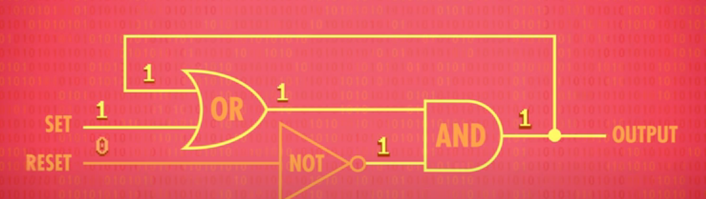

Ou activer Reset (Reset = 1) repasse le circuit à 0, tandis que set (Set = 1) passe le circuit à 1. Si les 2 sont à 0, c'est la derniere valeur qui prime

Cela permet donc de stocker 1 bit, d'ou le nom car le circuit s'accroche à une valeur.

Le circuit a été simplifié (pour l'utilisation) en permettant à avoir un seul point d'entrée que l'on peut set à 1 ou à 0. Pour cela, on a ajouté des gates.

Il a aussi été securisé avec un Write Enable pour permettre de lock la mémoire lorsqu'on l'a lit (Read) et la débloquer quand on l'écrit (Write). C'est à dire si le Write Enable est à 0, l'output est à 0 car c'est verouillé. C'est uniquement quand on passe le Write Enable a 1 que l'on peut output 1. Si on repasse le Write Enable à 0, la data restera à 1 et sera verouillé.

Ce qui donne le gated-latch.

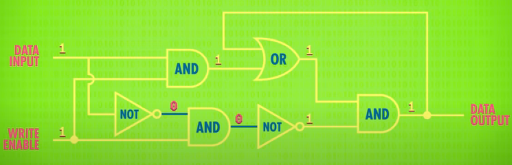

Un groupe de latch s'appelle un register. Il contient un seul chiffre, et le nombre de bits du register qui est sa longueur (width)

Ce qui nous donne un 8-bit register :

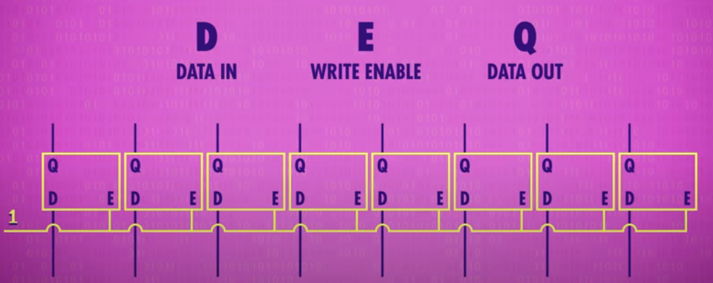

Il y a Write Enable pour l'ensemble du Register et une entrée/sortie pour chaque latch du register. Le problème de cette organisation est qu'elle scale tres mal sur la taille (même s'il n'y a qu'un seul Write Enable pour le register)

C'est pour cela que l'on utilise maintenant des matrix (16x16 matrix => 256bits). On utilise le principe des coordonées avec un And avec un cable par colonne et par ligne

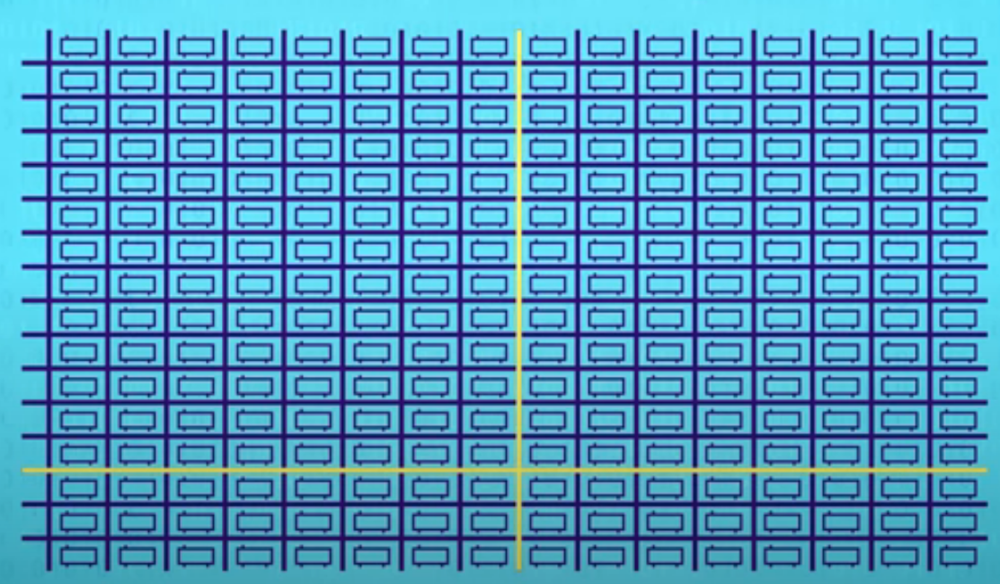

On voit que seulement une cell va être activé par la colonne et la ligne qui s'active, toutes les autres sont desactivées. Cela permet d'avoir Write-Enable et Data-In/out commun à toutes les cellules car un seul latch sera activés
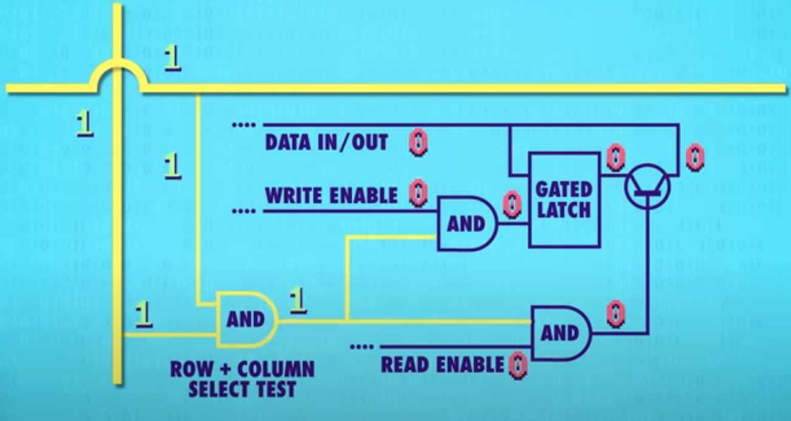

Cela signifie que pour avoir 256bits de mémoire, on a besoin de 35 cables - 1 data wire, 1 write enable wire, 1 read enable wire et 16 pour les colonnnnes et 16 pour les lignes au lieu des 500+ de l'autre situation.

Comme il y a 16 rows/colonnes, on store l'adresse dans un chiffre à 4 bits. Ce chiffre est envoyé à un component le MultiPlexer

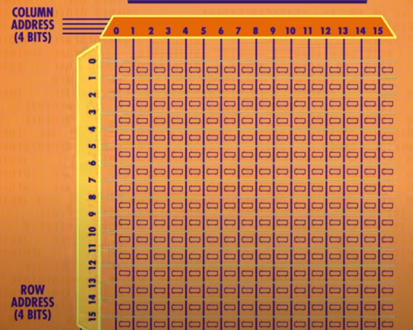

Il permet d'activer une ligne spécifique, on en prend un pour les colonnes et un pour les lignes. C'est à dire que pour faire marcher un registre de 256 bits, on a besoin de :
- 8 bit pour l'adresse des Latch
- Data (1bit)
- Write Enable (1 bit)
- Read Enable (1 bit)

Le probleme est que 256 bits est tres léger, donc il faut scale enccore plus (en les mettant en ligne comme pour le premier register). On les met 8 par 8 pour pouvoir stocker des données de 8 bits (au lieu de 1). On a besoin des Write Enable, Read Enable et de leur adresse pour chacun à nouveau.

On utilise la même adresse pour registre (organisation, simplicité)

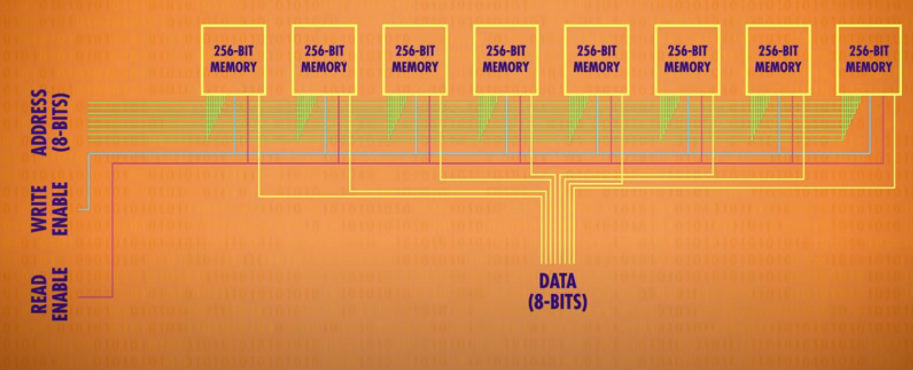

Ce qui nous donne, non pas une série de circuits, mais une banque de mémoire uniformisé de 256 adresses ou l'on peut lireou écrite une valeur de 8 bits.

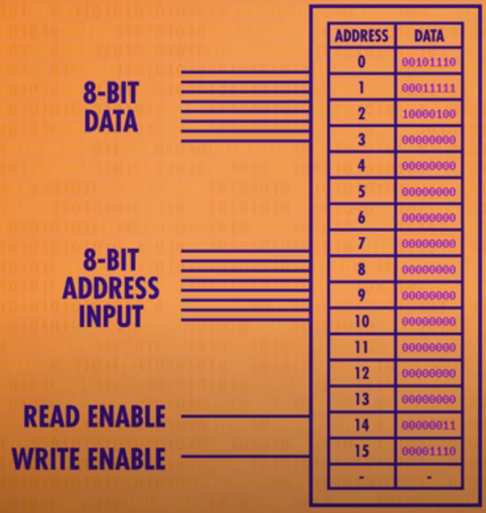

Le nom de RAM vient du fait qu'on peut acceder à n'importe quelle adresse, à n'importe quel moment dans un ordre aléatoire (d'ou Random-Acces Memory)

Plus d'informations dans la partie hardware pour l'illustration sur une vrai RAM

### SRAM (Static random-Access Memory)
Ce type de mémoire utilise des latch aussi
