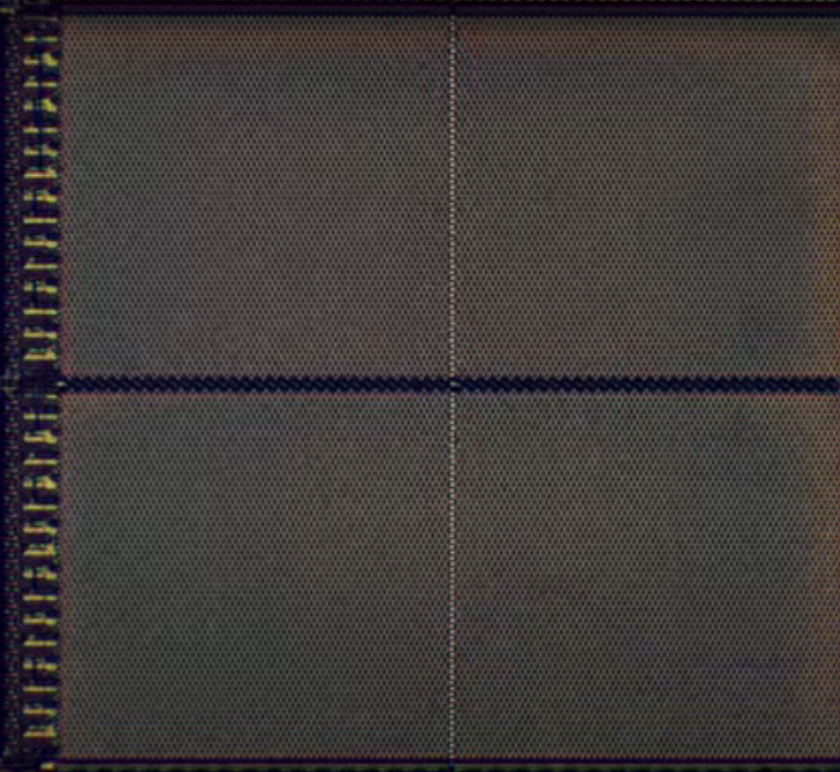

# Pieces informatiques

## Mechanical Relay
Cela permet d'ouvrir et fermer un courant avec un coil (bobine) qui permet de fermer le relais avec un champ electromagnetique. Le probleme  est que le bras qui s'ouvre et qui ferme a une masse et donc met du temps pour s'ouvrir et fermer. C'est à dire qu'en 1940, un bon relai peut s'ouvrir et se fermer 40 fois par seconde, ce qui est rapide mais pas si rapide( Une addition toutes les 3 secondes).

En plus, comme tous les éléments mécaniques, ils s'usent et s'abiment (possibilité d'erreur)

## Thermionic valve
Cela permet de remplacer le MEchanical relay. Systeme proche d'une ampoule. (A google plus si intéressé). Ils ont le défaut d'être fragile et peuvent brulés. Le gros point fort est qu'elles s'abimaient moins et pouvait faire plus de 1000 switch à la seconde (vs 40). Cela a permis de commencer l'electronic Computing avec le Colossus MK 1.

## Un transistor
Enfin, apres les problemes et l'usure des thermionic valve, le transistor a été inventé en 1947.

Un transistor a des mécaniques complexes basées sur des mécaniques quantines. Simplement, c'est un interrupteur qui peut être ouvert ou fermé grâce à un fil de control avec une entrée et une sortie. C'est pour cela qu'il a 3 electrodes (3 pates) lui permettant de controler un courant ou une tension. On parle de composant semi-conducteur car l'electrode de sortie et entré sont séparés par un materiel qui conduit ou ne conduit pas le courant.

La conductivité se fait en changeant la charge electrique de la gate, ce qui permet de faire passer le courantn ou non. Cela permet de passer de 1000 switch à 10000 switch par seconde et on parle du premier transistor (Beaucoup beaucoup plus gros).

La force du transistor est qu'il est fait de matériaux solide (Solid-State component) donc beaucoup plus résistant et moins prône à l'erreur. Tres rapidement, ils ont été miniaturisés, bien plus que les relay ou les vaccum on pu l'être. Cela a permis de réduire significativement la taille des ordinateurs.

Actuellement, les transistors font moins de 50 nanometres. Une feuille de papier a une épaisseur de 100 000 nanonmetres. Ils peuvent faire plusieurs millions de switch à la seconde et sont efficaces pendant des decennies.

Ils sont fait avec du silicon (semi-conducteur), et ont été developpé dans une valley entre SF & San Jose (d'où le nonm Silicon valley)

## RAM
Une barrette de RAM avec 8 Chip (gros carré noir), on peut voir les multiplexer

En ouvrant, un Chip on voit les différents carrés de mémoire, 32 exactements

Chacun de ces carrés est divisé en 4 blocks

Enfin, chacun de ces blocks correspond au matrix où chaque petit carré correspond à un bits. Ces matrix sont de 128x64 bits, soit 8192 bits en tout.

Ce qui nous amene à 32 768 bits par carré (4 matrix par carré), et environ 1 millions par chip (32 block de mémoire), ce qui arrive à notre 8millions bit (8 chip), ce qui nous amene à une RAM de 1mb (1 megabyte)
