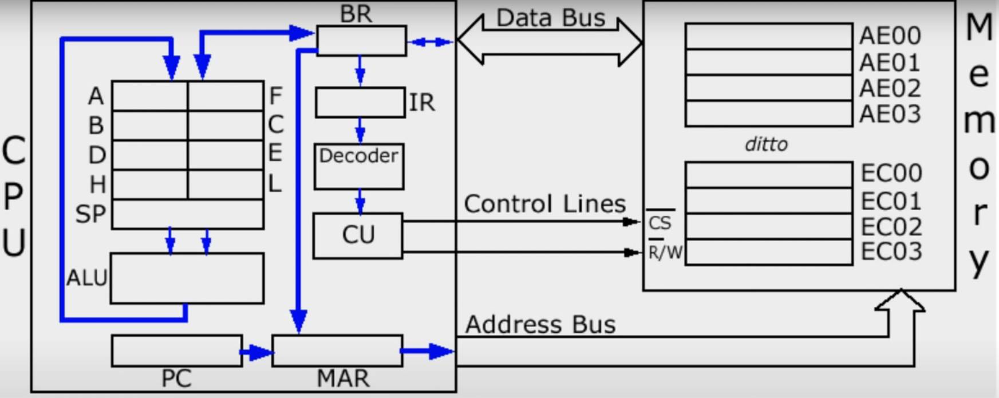
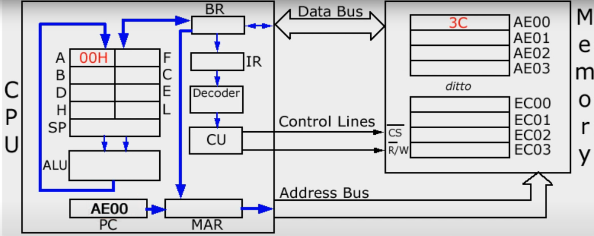

# Les basiques d'un ordinateur

## Comment le CPU execute un programe (Fetch-Decode-Execute Cycle)
En partant d'une ligne :
INC A (assembly) signifie incrémenter le registre A (c'est à dire ajouter 1 à A, peu importe ce qui est dedans). Cela prend la forme de :
00111100 en machine code (binaire).
Le binaire est souvent traduit en hexadecimal pour que ça soit plus simple à retenir, cela correspond donc à 3C

INC A = 00111100 = 3C

Voici, un schéma simplifié du systeme d'un microprocesseur :

Le code sera placé dans la premiere ligne (à droite) AE00, cette adresse sera mis dans le PC (Program Counter), en partant du principe que le registre A contient 00 (H signifie qu'on est en hexadecimal), on obtient ce statut ;

Le binary patern dans le Program Counter (AE00) est transferé dans le MAR (Memory Adress Register), ce qui fait que le PC (Program Counter) augemnte de 1, on passe donc à l'instrction AE01.

Le contenu du MAR (Memory Adress Register) est tranferé dans l'adress bus, et le CU (Control Unit) envoie 2 low pulses dans les 2 control lines (CS line & Read/Write line => R/W Line).

Un low pulse dans la CS Line est responsable d'activer la puce, et celui dans la R/W Line assure que la location selectionnée est lue.

Le "3C" parlt donc dans le BR (Buffer Register) via le Data Bus et une copie est envoyé dans le IR (Instruction Register).

A ce moment la, on est à la fin du "fetch" dans le fetch-decode execute cycle.

On commence donc le décodage de l'instruction. Le decoder détermine donc ce que 3C signifie et envoie l'information au CU (Control Unit). La valeur du registre A est envoyé dans l'ALU (Arithmetic and Logic Unit) et demande à l'ALU d'y ajouter 1

La nouvelle valeur est envoyé dans le registre A via l'internal Data Bus, ce qui conclut l'execute dans le fetch-decode-execute cycle.

## Comment un ordinateur Calcule? (ALU)

### Arithmetic Unit
Un ordinateur calcule grâce à l'ALU (Arithmetic and Logic Unit), c'est le cerveau mathématique de l'ordinateur. Elle a 2 units : celle arithmetic et celle logic.

L'arithmetic permet de faire des additions, soustractions, incrementer, decrementer. Pour simplifier le système, on utilise de l'abstraction et créer les composants basés sur de la logique (AND, OR, NOT, XOR). (XOR est un OU exclusif, c'est à dire l'un ou l'autre)

Voici les 4 d'opérations possibles :

Dans le cas, du 1+1, c'est égal à 0 et le 1 est avancé sur la colonne suivannte. Ces opérations collent parfaitement avec  un tableau de logic, en partant du principe que 0 = false et 1 = true

Le circuit ci-dessus est appelé un Half Adder. Il permet d'avoir 2 output : Sum et Carry basé si A & B sont vrai. Si les 2 sont vrai, la somme est fausse avec le XOR mais le carry est vrai avec le AND

Cela nous donne cette encapsulation :

Le probleme c'est que cette logique ne marche qu'avec 2 bits, en prenant en compte le carry, il faut pouvoir prendre en compte 3 bits : A, B, C

Ce qui amene à la Full Adder table :

et la logique du fulladder, qui est 2 half adder : une avec les 2 valeurs initiales A & B et une avec le carry qui permet de déterminer la sum final et le carry final

Si on veut augmenter le nombre de bit supportés, il suffit juste d'aggrandir la séquence où la premiere opération ne nécessite que d'un half adder car il n'y a pas encore de carry, puis elle est suivi de full adder.

Le problème du full adder est qu'il peut finir avec un carry s'il dépasse 8bits, ce qui provoque un overflow. C'est pour cela que les éléments de 8 bits ne peuvent pas dépasser 255.

Pour éviter l'overflow, on peut aggrandir le cycle avec plus de full adder pour arriver à 16/32/64 bits mais cela prend plus de gate et cela prend plus de temps pour le carry d'être passé de cycle en cycle.

C'est pour cela que les LUA actuels utilisent un "Carry-look-ahead adder", c'est plus rapide et a la même fonctionnalité. Ce qui donne ces fonctionnalités :

Il n'y a pas de multiplication, ni de division. Aucun circuit n'est prévu pour ces opérations, l'opération fait plusieurs fois le même circuit (addition) pour faire une multiplication.

Maintenant, les téléphones portables/ordinateurs portables ont des circuits dédiés pour les multiplications. Cela nécessite plus de logic gates, c'est donc reservés aux machines puissantes et pas les éléments simples comme des micro-ondes ou des thermometres.

### Logic Unit

Elle permet de faire plusieurs tests et utilisent le même type de circuit que l'arithmetic unit. Par exemple, pour tester si un chiffre est inférieur à 0 ou si le chiffre est égal à 0. Pour tester, si un chiffre est égal à 0, on a ce type de circuit :

et un Not est utilisé entre le dernier OR et l'output avant d'inverser l'output pour savoir si le chiffre est bien égal à 0 (car 0 = false)

### ALU schema

Premier ALu par Intel :

Les Alu suivent un schéma "V", voici un schéma pour un ALU à 8 bits :

Il y a donc 3 entrées : Input A, Input B qui vont être manipulés, l'opération code qui va être comment les variables vont être manipulés (00111100 ou 3C pour INC A dans l'exemple du fonctionnement du CPU)  et 2 sorties : le résultat qui est celui de l'opération et les flags qui ajoutent des informations sur l'output
