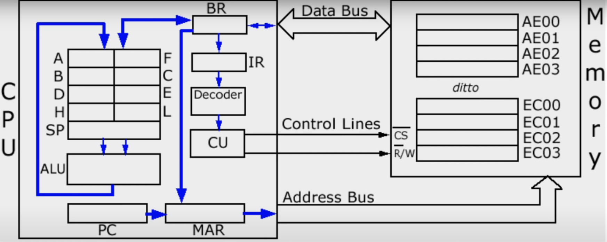
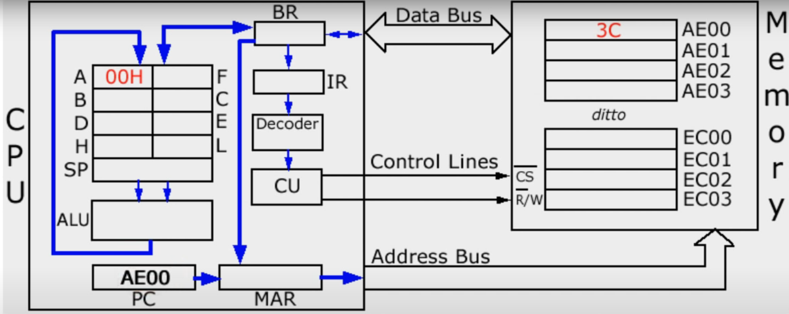
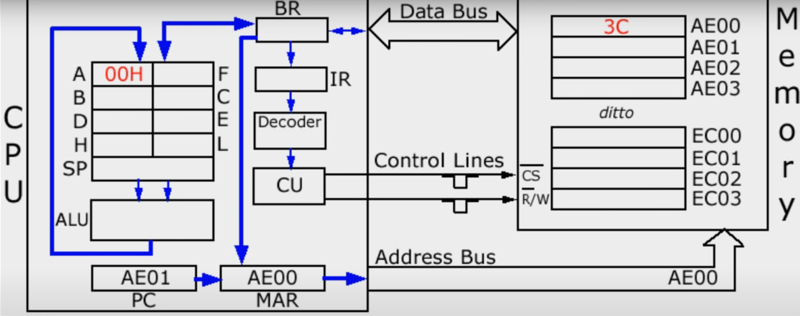
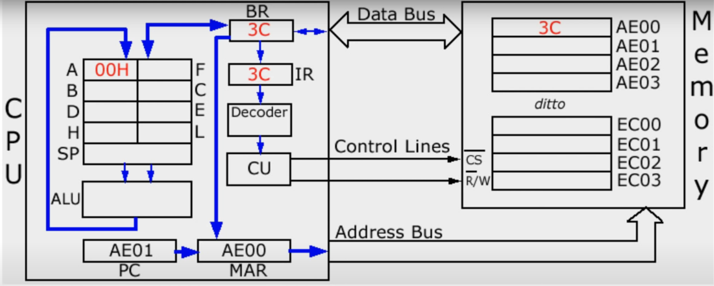
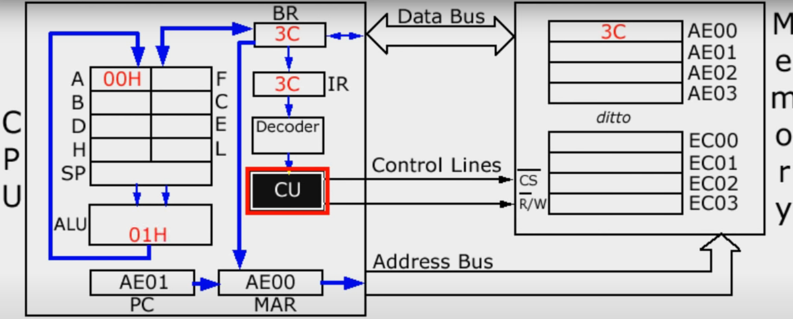

# comment fonctionne un ordinateur
En partant d'une ligne :
INC A (assembly) signifie incrémenter le registre A (c'est à dire ajouter 1 à A, peu importe ce qui est dedans). Cela prend la forme de :
00111100 en machine code (binaire).
Le binaire est souvent traduit en hexadecimal pour que ça soit plus simple à retenir, cela correspond donc à 3C

INC A = 00111100 = 3C

Voici, un schéma simplifié du systeme d'un microprocesseur :

Le code sera placé dans la premiere ligne (à droite) AE00, cette adresse sera mis dans le PC (Program Counter), en partant du principe que le registre A contient 00 (H signifie qu'on est en hexadecimal), on obtient ce statut ;

Le binary patern dans le Program Counter (AE00) est transferé dans le MAR (Memory Adress Register), ce qui fait que le PC (Program Counter) augemnte de 1, on passe donc à l'instrction AE01.

Le contenu du MAR (Memory Adress Register) est tranferé dans l'adress bus, et le CU (Control Unit) envoie 2 low pulses dans les 2 control lines (CS line & Read/Write line => R/W Line).

Un low pulse dans la CS Line est responsable d'activer la puce, et celui dans la R/W Line assure que la location selectionnée est lue.

Le "3C" parlt donc dans le BR (Buffer Register) via le Data Bus et une copie est envoyé dans le IR (Instruction Register).

A ce moment la, on est à la fin du "fetch" dans le fetch-decode execute cycle.

On commence donc le décodage de l'instruction. Le decoder détermine donc ce que 3C signifie et envoie l'information au CU (Control Unit). La valeur du registre A est envoyé dans l'ALU (Arithmetic and Logic Unit) et demande à l'ALU d'y ajouter 1

La nouvelle valeur est envoyé dans le registre A via l'internal Data Bus, ce qui conclut l'execute dans le fetch-decode-execute cycle.
