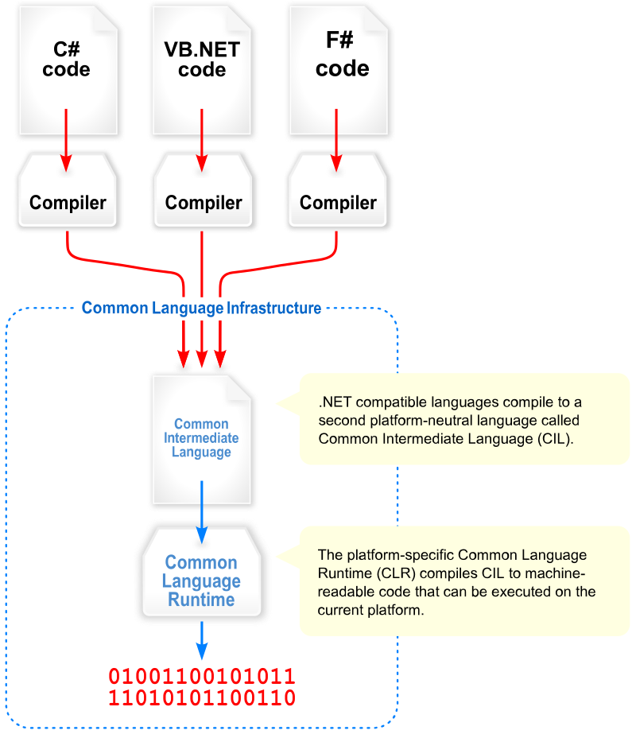

# Microsoft

## Organisation général

### Common Language Infrastructure (CLI)
Cela permet d'avoir un code exécutable dans un environnement en runtime qui supporte plusieurs langages de haut niveau et sur différentes plateformes sans avoir à ré-écrire des architectures spécifiques.

Microsoft utilise un intermediate Language (IL) ou (CIL) Common Intermediate Language pour définir les instructions binaires et se rapproche de l'architecture des CPU. C'est à dire que les données sont push dans des stacks plutôt que tirer de registre. Le langage est orienté objet et stack-based

## .Net (.NET Platform)
