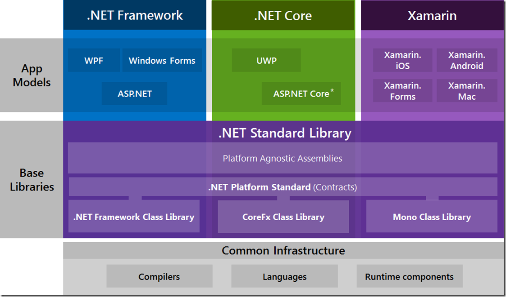

# Microsoft

## Organisation général

### Common Language Infrastructure (CLI)
Cela permet d'avoir un code exécutable dans un environnement en runtime qui supporte plusieurs langages de haut niveau et sur différentes plateformes sans avoir à ré-écrire des architectures spécifiques.

Microsoft utilise un intermediate Language (IL) ou (CIL) Common Intermediate Language pour définir les instructions binaires et se rapproche de l'architecture des CPU. C'est à dire que les données sont push dans des stacks plutôt que tirer de registre. Le langage est orienté objet et stack-based

### Outils
- Visual Studio
- SQL Server
- SQL Server Management Studio (UI de SQl server)

## .Net (.NET Platform)

L'avantage de cet outil est de prendre en compte tout ce qui est commun aux applications pour que les développeurs puissent se concentrer sur leur spécificité et pas le fonctionnement générique.

On peut voir qu'il y a 3 couches. La premiere est l'Infrastructure qui est partagé par tout l'éco-systeme, c'est ce qui va permettre de créer le runtime avec le CLR (Common Language Runtime) et le CIL (Common Intermediate language).

Construit sur cette base, on obtient la librairie .NET standard qui permettent d'avoir une vaste collection de code pour s'occuper des taches récurentes comme le networking, file system acces, etc. C'est un code qui est utilisabble sur n'importe quel type d'application.

Enfin, la derniere couche est divisé en plusieurs parties. Ce sont différents stacks / implementation de la platforme .NET. Il y a plusieurs stacks, mais les 3 du diagrame sont les principaux. Ils ont toutes une configuration de .NET particuliere. Certains éléments comme le CLR peuvent être remplacés par des éléments compatibles. Dans certains cas, même la librairie  standard peut être remplacer.

Chacun de ces stacks sont crées avec des utilités spécifiques. Par exemple, .NET Framework est adapté pour les machine windows, c'est le plus vieux et le plus gros, tandis que le .Core est plus récent, plus léger et multiplateforme.

Ces stacks supportent un certain nombre d'app models, c'est à dire une librairie dédié à créer un type d'app  en particulier.

## Terminologie
Le terme .NET Framework peut être confus car il est utilisé dans plusieurs cas :
- L'ecosysteme entier (.NET platform)
- Le stack .NET framework (comme Xamarin ou .NET core)
- Template a quoi doit ressembler un stack

## Specificité

Pour la plupart des composants, il y a une Specificité de comment ils sont censés fonctionner et une ou plusieurs implémentations pour cette spécificité. Par exemple, le C# Compiler, il y a plusieurs spécifcité de comment le C# doit être compiler. Le composant est "Roslyn Compiler)" par défaut mais il peut être remplacer.

## Binary, Assembly & Compiler
L'idée est de compiler dans un langage à un autre et de descendre dans les niveaux pour attendre le binaire (Assembly => Binary)

Le problème principal est que tous les CPU ne sont pas fait de la même manière, ils n'utilisent pas les mêmes OPcodes pour les instructions et tous les CPU n'ont pas les mêmes sets d'instructions.

L'assembly reste quand même bas niveau et prend du temps à écrire. En général, l'assembly est un produit du C++ compilé (ou FORTRAN/C), c'est pas quelque chose de standard (exemple).

On arrive toujours au même problème, c'est qu'on ne peut pas avoir un .exe par machine pour que chaque CPU puisse l'executer, ce qui favorise un grand nombre de compilers ou pleines de configurations différentes d'un compiler.

## Virtual Machine & CLR
Une variation de la compilation classique est arrivé, ce n'est pas pour cela qu'elle remplace cette derniere. C'est l'approche que C# et .NET ont pris.

Cette approche provient des 2 problemes de la compilation classique. Le premier est le nombre de compilers nécessaires pour cibler chaque type d'hardware et leur nuance. Le second est que les compilers dev ont besoin d'être des expert dans leur domaine mais aussi dans toutes les platformes hardwares qu'ils veulent utiliser.

Le terme virtual machine a plusieurs sens basé sur le context. En l'occurence, on se refere au fait de process une machine vritual qui est un logiciel qui execute un autre logiciel (le program) d'une façon qui est indépendante du matériel (hardware). Cela s'oppose à l'application virtual machine qui est un logiciel qui simule un ordinateur en entier (c'est à dire hardware, OS compris)

.NET platform utilise une machine virtruelle CLR (Common Language Runtime), qui comme ,les composants de .NET, a des spécificités et qui a plusieurs implémentations. Chaque stack tend à avoir sa propre implemntation. .NET Framework utilise CLR, .NET CORE utilise CoreCLR et Xamarin utilise Mono Runtime.

Un vrai ordinateur peut faire des instructions spécifiques et un code binaire (& assembly) qui y est associé. De la même manière, une machine comme CLR a ses propres instructions.

Si une application veut cibler une machine virtual CLR au lieu de n'importe quel machine, il faut compiler avec les instructions compatibles avec le CLR. Ce dernier s'occupera alors de les traduire pour le "vrai" hardware.

En gros, il y a 2 étapes de compilations :
- Transformer en set d'instructions pour la machine virtruelle
- Puis pendant le runtime, le CLR fait la derniere compilation qui transforme les instructions pour celle de la machine physique. Ce compiler s'appelle le JIT compiler (just-in time compiler)

JIT compile les méthodes une à la fois, la première fois qu'elles sont appelées. C'est à dire que rien n'est compilé plus d'une fois et les méthodes qui ne sont pas utilisées ne sont jamais traduites.

### Common Intermediate Language (CIL)
Les instructions virtuellse sont referencés comme langage intermediaire, cela peut être en binaire ou en texte (assembly like).

.NET platforme utilise le CIL ou MSIL (Microsoft Intermediate Language) (même chose). l'avantage est que cela permet d'avoir un plus haut niveau et donc avoir des concepts de POO comme casting, type checjing & exception handling.

### Avantages de la VM

#### Séparations des problemes
Cela permet de séparer les problèmes. Le C# n'a pas besoin de s'occuper des problemes d'hardware et le JIT n'a pas besoin de s'occuper des problemes de langages.

#### Cross-Languages Librairies
Cela permet d'avoir des librairies cross-language comme la .NET standard librairie. C'est pour cela que le C#, VB.NET, F#, IronPython sont compatibles

#### memory Management
Le CLR s'occupe aussi de gérer la mémoire. Il n'y a pas besoin d'allouer de la mémoire pour les objets ou de clean la mémoire la plupart du temps.

#### Security
Le fait d'être sur une virtual machine permet d'avoir un niveau de control polus haut sur cequi peut acceder au hard drive, network et le reste du hardware. Le CLR contrôle la mémoire et donc limite les codes dangereux.

### Desavantages des VM

#### Performance
Le principal défaut est les performances. Un code en VM est plus lent qu'un code qui s'execute directement sur le hardware (pas besoin de l'étape du JIT compiler pour executer une instructions)

En général, la plupart des applications n'ont pas de problème de vitesse d'execution. La plupart du temps, elles attendent l'input de l'utilisateurs

De plus, c'est techniquement possible d'avoir du code sur une VM plus rapide que du hardware car le JIT a plus d'informations et donc peut prendre des meilleurs décisions sur ce qu'il faut utiliser (C'est très rare)

Enfin, C# peut faire du unmanaged code et donc appeler du C ou C++ pour les endroits où les performances sont vitales.

#### Mauvais pour le code à bas niveau
Il y a certaines choses qu'une VM ne peut pas faire car c'est une couche applicative et pas directement le hardware. C'est donc impossible de faire une OS en C# ou un drive qui communique directement avec le hardware.

#### Le code est plus visible
Il est beaucoup plus simple de compiler un code en C# (ILspy ou autre), c'est tres rapide. Cela peut être compenser par un code obfuscator avant de ship le projet.

##Standard Librairie
Comme expliqué précédemment, la librairie standard permet d'inclure beaucoup de fonctionnalités. Il faut garder à l'esprit qu'on peut choisir la version de .NET standard. La 1.0 inclut Action & Func par exemple et la 1.1 inclut ZipArchives.

Plus on utilise une version haute, plus on a de types utilisables, mais plus on prend une version basse, plus le code peut être distribuer sans soucis de compatibiltié.

## App models
Tres vaste :
- WPF (GUi) ou UWP (Universel GUI mais moins puissant)
- ASP.NET ou ASP.NET Core pour les webs apps

## Nugget Package
Custom Nugget Package
Importer les raw files
